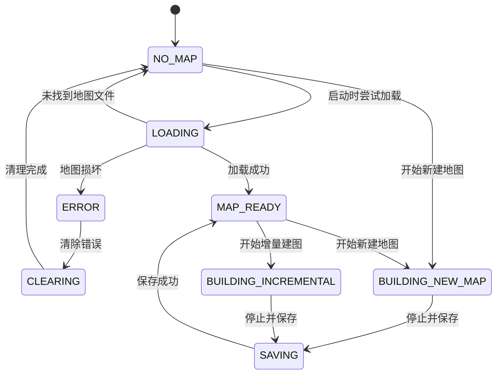
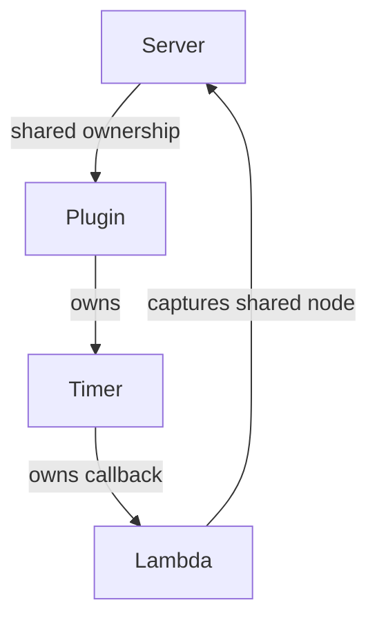

# Mapping 模块设计

本文介绍 Mapping 模块中以下两个主要部分的职责、状态流转、操作接口及实现注意事项：

| 模块 | 主要职责 |
| --- | --- |
| `ordinary_occupancy_mapping` | 根据地面点云与非地面点云构建、保存、加载并发布二维占据栅格地图 |
| `field_map_builder` | 根据占据栅格地图构建并发布 ESDF 地图/对外提供 ESDF 数据接口查询 |

---

## 1. Ordinary Occupancy Mapping

### 1.1 状态定义

| 状态 | 含义 |
| --- | --- |
| `NO_MAP` | 当前没有可用地图 |
| `LOADING` | 正在从默认路径加载地图 |
| `MAP_READY` | 地图已准备完成，可以对外发布或用于增量建图 |
| `BUILDING_NEW_MAP` | 正在构建一张新地图 |
| `BUILDING_INCREMENTAL` | 正在已有地图上进行增量建图 |
| `SAVING` | 正在保存当前地图 |
| `CLEARING` | 正在清除错误状态（删除地图文件） |
| `ERROR` | 地图加载或处理过程中发生错误 |

### 1.2 状态流转

节点启动后，内部状态默认为 `NO_MAP`，随后进入 `LOADING`，尝试从默认位置加载已有地图：

- 加载成功：进入 `MAP_READY`；
- 地图文件损坏：进入 `ERROR`；
- 未找到地图文件：返回 `NO_MAP`。

完整状态流转关系如下：



### 1.3 状态约束

| 目标状态或操作 | 前置状态 | 说明 |
| --- | --- | --- |
| `CLEARING` | `ERROR` | 用于错误恢复，会清除已有地图 |
| `BUILDING_NEW_MAP` | `NO_MAP` 或 `MAP_READY` | 开始构建新地图 |
| `BUILDING_INCREMENTAL` | `MAP_READY` | 只有存在可用地图时才能进行增量建图 |
| `SAVING` | `BUILDING_NEW_MAP` 或 `BUILDING_INCREMENTAL` | 只有正在建图时才能执行停止与保存 |
| `MAP_READY` | `SAVING` 成功 | 保存完成后进入该状态并发布地图 |

> [!IMPORTANT]
> 处于 `ERROR` 时不能直接重新建图，必须先完成 `ERROR → CLEARING → NO_MAP` 的恢复流程。

### 1.4 常见使用流程

1. **首次使用**

   `LOADING → NO_MAP → BUILDING_NEW_MAP → SAVING → MAP_READY`

2. **加载已有地图**

   `LOADING → MAP_READY`

3. **在已有地图上增量建图**

   `LOADING → MAP_READY → BUILDING_INCREMENTAL → SAVING → MAP_READY`

4. **加载地图失败后重新建图**

   `LOADING → ERROR → CLEARING → NO_MAP → BUILDING_NEW_MAP → SAVING → MAP_READY`

5. **重新建图**

   `MAP_READY → BUILDING_NEW_MAP → SAVING → MAP_READY`

### 1.5 建图相关服务

> [!NOTE]
> 下列服务名称为默认示例。实际使用时，请以 `bringup.yaml` 中配置的服务名称为准。

```bash
# 开始构建新地图
ros2 service call /start_static_mapping std_srvs/srv/Trigger "{}"

# 停止建图并保存地图
ros2 service call /stop_static_mapping std_srvs/srv/Trigger "{}"

# 清除错误
ros2 service call /error_clearing std_srvs/srv/Trigger "{}"

# 开始增量建图
ros2 service call /start_incremental std_srvs/srv/Trigger "{}"
```

### 1.6 点云订阅与地图发布策略

`groundCallback()` 和 `nonGroundCallback()` 仅在以下状态运行：

- `BUILDING_NEW_MAP`；
- `BUILDING_INCREMENTAL`。

对应的 subscription 也只有在建图服务被调用后才会实例化。

`final_cells` 与 OccupancyGrid 之间的转换及发布策略如下：

| 当前状态 | 转换与发布行为 |
| --- | --- |
| `BUILDING_NEW_MAP` | 每处理一帧点云，更新并发布一次地图 |
| `BUILDING_INCREMENTAL` | 每处理一帧点云，更新并发布一次地图 |
| `MAP_READY` | 通过定时器，按照 `map_publish_frequency_` 指定的频率发布静态地图 |
| 其他状态 | 不发布地图 |

具体参数含义可参见 `ordinary_occupancy_mapping.hpp` 中的代码注释。

---

## 2. Field Map Builder

### 2.1 文件职责

| 文件 | 职责 |
| --- | --- |
| `utility/esdf_query.hpp` / `utility/esdf_query.cpp` | 对外提供 ESDF 数据查询接口 |
| `esdf_map_builder.hpp` / `esdf_map_builder.cpp` | 实现 ESDF 地图本体的构建与发布 |

### 2.2 输入与输出

| 类型 | 参数 | 说明 |
| --- | --- | --- |
| 输入 | `input_costmap_topic` | 输入的栅格代价地图话题 |
| 输出 | `esdf_debug_topic` | ESDF 调试话题，仅用于 RViz2 可视化 |
| 输出 | `esdf_topic` | 真正对外发布的 ESDF 地图话题 |

### 2.3 主要参数

| 参数 | 含义 |
| --- | --- |
| `unknown_as_obstacle` | 是否将 unknown 栅格视为障碍物 |
| `publish_debug_esdf` | 是否发布用于可视化的 ESDF 调试地图 |
| `max_esdf_distance` | ESDF 中保留的最大距离 |

> [!NOTE]
> ESDF 构建所使用的二维 EDT（Euclidean Distance Transform，欧氏距离变换）算法及其实现细节可参见源码注释。

---

## 3. Timer 与 Service 回调中的节点生命周期

### 3.1 错误写法

在 timer 或 service callback 中需要访问节点时，不能将 `node` 的共享指针直接捕获到长期存活的 lambda 中：

```cpp
state_timer_ =
    node->create_wall_timer(
        50ms,
        [this, node]()
        {
            this->stateTimerCallback(node);
        });
```

上述写法会使 lambda 长期持有 `node`，从而形成循环引用：



只要这个引用环仍然存在，相关对象就无法正常释放。

### 3.2 推荐写法

插件内部使用 `std::weak_ptr` 保存节点引用；需要访问节点时，再在回调中临时获取共享指针：

```cpp
auto node = node_.lock();
if (!node)
{
    return;
}

// 仅在当前作用域内使用 node
```

这样可以在回调执行期间保证节点有效，同时避免 timer、lambda 与节点之间形成永久循环引用。