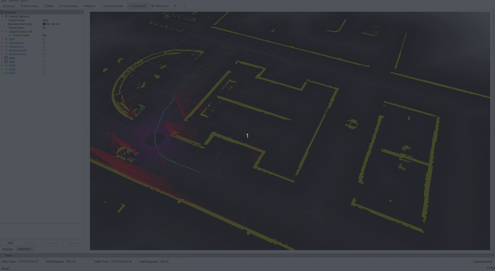
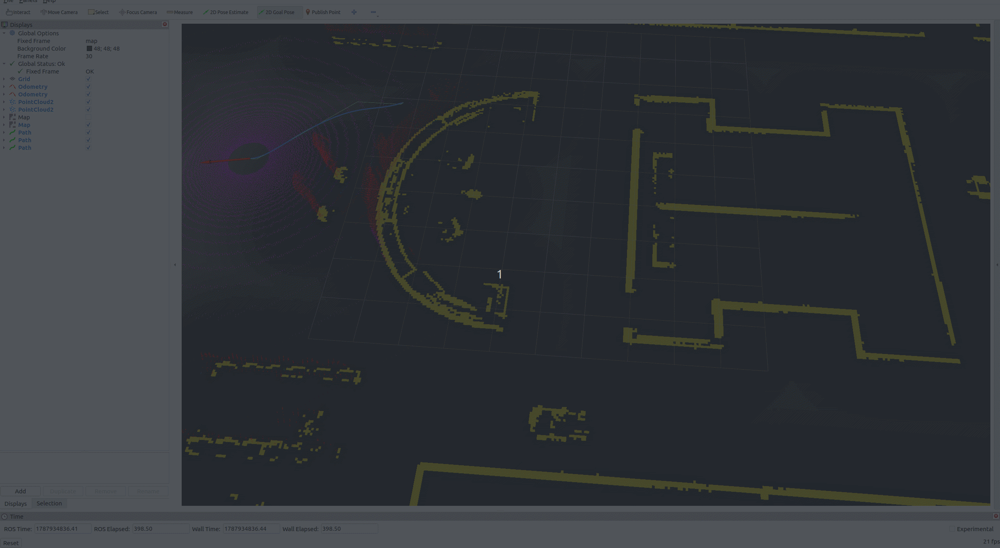
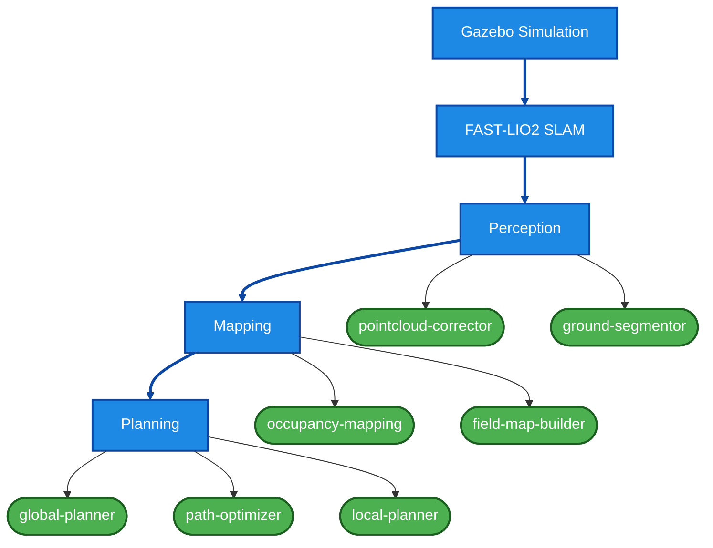

# TrailBlazer Community

> A modular ROS 2 autonomy stack integrating simulation, LiDAR–IMU SLAM, perception, mapping, path planning, path optimization, and local control.

TrailBlazer Community 是一个面向移动机器人自主导航的开源 ROS 2 项目。项目覆盖从 Gazebo 仿真、FAST-LIO2 激光雷达–惯性 SLAM，到点云感知、占据栅格与 ESDF 地图构建、全局路径规划、路径优化和 MPPI 局部控制的完整链路。

导航框架在架构上参考 Navigation2 的分层思想，但并不是 Nav2 的简单封装或分支：各功能模块由生命周期管理的 Server、稳定的抽象接口和可动态加载的算法插件组成，并通过统一的 bringup 包完成参数配置和系统启动。

> **Project status:** TrailBlazer Community is under active development. Core navigation modules are available, while documentation, component composition, tests, and deployment workflows are still being improved.

## Demo

<p align="center">
  
  
</p>

<p align="center">
  Gazebo simulation with FAST-LIO2, perception, ESDF mapping,
  global planning, B-spline optimization, and MPPI control.
</p>


## Highlights

- **完整自主导航链路**：集成仿真、SLAM、感知、建图、全局规划、路径优化和局部控制。
- **插件化算法层**：算法实现通过 `pluginlib` 动态加载，可在不修改 Server 主体的情况下替换或扩展算法。
- **生命周期管理**：核心 Server 使用 ROS 2 Lifecycle Node，由 Lifecycle Manager 统一执行 configure、activate、deactivate 和 cleanup。
- **Server 与算法解耦**：Server 负责 ROS 2 通信、参数、状态和资源管理；插件专注于算法实现。
- **统一启动与配置**：`trailblazer_bringup` 集中管理参数、插件选择、节点启动顺序和自动激活。
- **多 Server 协同运行**：感知、地图、规划和控制 Server 可作为独立节点同时运行，便于隔离故障和调试。
- **面向组件化部署**：后续将通过 `rclcpp_components` 提供可选 composition 模式，使 Server 既可作为独立进程运行，也可按需装载到同一组件容器中。

## System Overview



### Server–Plugin–Lifecycle architecture

每个导航模块通常由三层组成：

| Layer | Responsibility |
| --- | --- |
| Server | ROS 2 topic/service/action、参数声明、生命周期回调、资源和插件实例管理 |
| Base interface | 定义稳定的算法接口，隔离 Server 与具体实现 |
| Algorithm plugin | 实现具体算法，并以共享库形式由 `pluginlib` 加载 |

插件类型和参数由 YAML 选择。当前的“可插拔替换”主要指在启动或生命周期重新配置时切换算法实现；项目暂不宣称支持运行中无中断的零停机热更新。

## Implemented Modules

| Area | Package / component | Current implementation |
| --- | --- | --- |
| Simulation | `gazebo_module` | Robot model, sensors, ros2_control, Gazebo worlds, launch and RViz configuration |
| SLAM | `FAST_LIO_SLAM_ros2` | FAST-LIO2-based LiDAR–IMU odometry and mapping |
| LiDAR drivers | `lio-drivers` | Livox ROS 2 driver integrations |
| Perception | `pointcloud_corrector` | Point-cloud frame/alignment correction |
| Perception | `ground_segmentor` | Local point-cloud ground segmentation(Currently local-PCA-based) |
| Mapping | `occupancy_mapping` | Static/ordinary occupancy-grid construction and map I/O |
| Mapping | `field_map_builder` | (Currently) Signed ESDF construction, publication, and interpolation-based query utility |
| Mapping interfaces | `trailblazer_map_interfaces` | Custom map/status messages and service interfaces |
| Global planning | `global_planner` | (Currently) ESDF-aware A* global path planning |
| Path optimization | `path_optimizer` | (Currently) Uniform B-spline trajectory representation with L-BFGS optimization |
| Local planning | `local_planner` | (Currently) Critic-based MPPI sampling, optimization, path tracking, and footprint evaluation |
| System bringup | `trailblazer_bringup` | Centralized parameters, plugin selection, launch, and lifecycle management |

## Repository Structure

The root README only introduces the complete system. Algorithm principles, interfaces, parameters, concurrency design, and implementation details are documented in the corresponding `DESIGN.md` files(incomplete yet).

(To-do)More detailed documents:

- [Perception design](NAVIGATION/perception/DESIGN.md)
- [Mapping design](NAVIGATION/mapping/DESIGN.md)
- [Planning design](NAVIGATION/planning/DESIGN.md)

## Platform

The current development and validation environment is:

- Ubuntu 22.04
- ROS 2 Humble
- C++17
- Gazebo and RViz2
- PCL, Eigen3, `pluginlib`, and ROS 2 Lifecycle

Other ROS 2 distributions and platforms have not yet been fully validated.

## Build

Create a ROS 2 workspace and clone the repository into its `src` directory:

```bash
mkdir -p ~/trailblazer_ws/src
cd ~/trailblazer_ws/src
git clone https://github.com/Gerrylgr/TrailBlazer_Community.git

cd ~/trailblazer_ws
rosdep install --from-paths src --ignore-src -r -y
colcon build --symlink-install --cmake-args -DCMAKE_BUILD_TYPE=Release
source install/setup.bash
```

## Run

For a full simulation, start the Gazebo environment and the selected SLAM configuration before the navigation bringup:

```bash
source ~/trailblazer_ws/install/setup.bash
ros2 launch gazebo_module gazebo_new.launch.py 
ros2 launch fast_lio mapping.launch.py
```

The navigation Servers are configured centrally in:

```text
NAVIGATION/trailblazer_bringup/config/bringup.yaml
```

Start the navigation stack with:

```bash
source ~/trailblazer_ws/install/setup.bash
ros2 launch trailblazer_bringup bringup.launch.py
```

## Plugin Configuration

Algorithm implementations are selected from `bringup.yaml`. A typical Server configuration contains the plugin ID, implementation type, and plugin-specific parameters:

```yaml
<server_name>:
  ros__parameters:
    plugin: <plugin_id>
    <plugin_id>:
      plugin: <package_namespace/PluginType>
      # plugin-specific parameters
```

The exact schema of each module is documented in its package-level `DESIGN.md`.

## Roadmap

- [x] Gazebo robot and sensor simulation
- [x] FAST-LIO2 integration
- [x] Point-cloud correction and ground segmentation
- [x] Occupancy-grid and Signed ESDF mapping
- [x] ESDF A* global planning
- [x] B-spline + L-BFGS path optimization
- [x] Critic-based MPPI local planning
- [ ] Optional standalone-process / component-container deployment
- [ ] Additional pluggable algorithm implementations for perception, mapping, and planning modules
- [ ] Complete package-level API and parameter documentation
- [ ] Reproducible end-to-end simulation setup and launch workflow
- [ ] Automated tests, CI, and benchmark reports

## Contributing

Issues and pull requests are welcome. When reporting a problem, please include:

- ROS 2 distribution and operating system
- Relevant parameter files
- Launch command and complete error log
- Sensor/topic/frame configuration
- Minimal steps required to reproduce the issue

## Third-Party Software

This repository integrates or vendors third-party projects, including:

- [FAST_LIO_SLAM_ros2](https://github.com/rohrschacht/FAST_LIO_SLAM_ros2)
- [FAST-LIO2](https://github.com/hku-mars/FAST_LIO)
- [Livox ROS Driver 2](https://github.com/Livox-SDK/livox_ros_driver2)
- [LBFGS-Lite](https://github.com/ZJU-FAST-Lab/LBFGS-Lite)
- [aws-robomaker-hospital-world](https://github.com/aws-robotics/aws-robomaker-hospital-world)

Their original copyright notices and licenses remain applicable. See the corresponding subdirectories for details.

## License

TrailBlazer Community's own source code is distributed under the license declared in this repository. Third-party components remain governed by their original licenses.

## Disclaimer

This project is currently intended for research, education, and development. Validate safety-critical behavior independently before deploying it on a real robot.

## Citation

When redistributing the source code or a derivative work, you must retain
the copyright and license notices required by GPL-3.0.

For academic publications, projects, theses, videos, and other public works,
citation or acknowledgement of TrailBlazer Community and its author,
Gengrui Liu (刘耕睿), is sincerely appreciated.

> Liu, Gengrui. (2026). *TrailBlazer Community* [Computer software].
> GitHub. https://github.com/Gerrylgr/TrailBlazer_Community